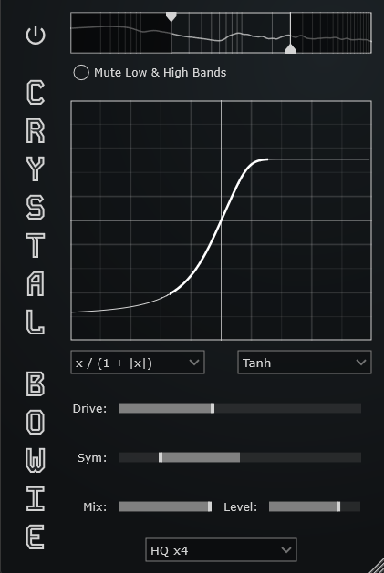

# Crystal Bowie
An audio plugin for creating a simple customizable clipper.
## Overview
Over the years I have collected a few different clipping algoithms that all more or less accomplish the same thing, but with slight variations - mostly in the shape of the *knee* (or curve) of the soft clipping.

So I created __Crystal Bowie__ as a way to quickly compare them in a neat little interface with some additional features to make it useful in production applications as well.

None of these algorithms are new or groundbreaking, but I just wanted to group them together for comparison in a handy tool, so here it is.

## The Plugin

Out of the box __Crystal Bowie__ supports VST3, CLAP, LV2, and AU for  Windows, MacOS and Linux.

The UI uses 100% vector graphics and so can be resized freely.

### Additional Features
- Specify the clipping algorithm for positive and negative signals separately.
- Control the symmetry of the clipping threshold.
- Use crossover filters to focus the clipping on a specific part of the frequeny spectrum.
- Basic volume compensation.
- Oversampling.

## Dependancies

The effect was built using the [JUCE Framework](https://github.com/juce-framework/JUCE), which has been added to the git project as a submodule.
Likewise the CLAP format support is added using the [clap juce extensions](https://github.com/free-audio/clap-juce-extensions) library (also added as a submodule).
*When JUCE officially support CLAP, I'll update that part of the codebase.*

I have also included my own [IADSP](https://github.com/IcebreakerAudio/IADSP) library for some simple DSP and helper classes and functions.

The UI uses the __Roboto__ font which has an OLF license.

## Build

__Crystal Bowie__ can be built using CMake.
The CMake files were based off the [pamplejuce](https://github.com/sudara/pamplejuce) template, but simplified.

Personally I use [Visual Studio Code](https://code.visualstudio.com/) for working on and building the project, but you can also build from the terminal if you have CMake installed and set up for that.

## Install

Pre-built binaries are available [here](https://github.com/IcebreakerAudio/Crystal-Bowie/releases). You just need to place them in the correct directory (info is available on the release page).

Note that Apple have a very heavy-handed security system that will probably block the plugins from being used. You will need to update the MacOS security features to either allow unsigned files, or to exclude the plugin files (the method for how to do this changes now and again, so Google for the latest technique).

If you build the plugins yourself then you won't need to deal with the security stuff since you create the plugin binaries.
